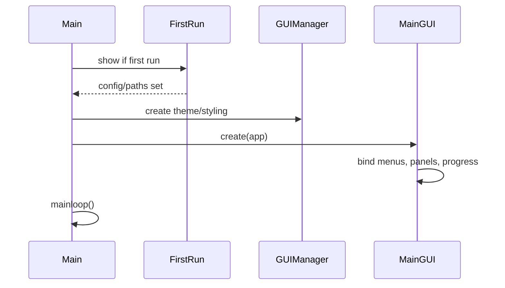
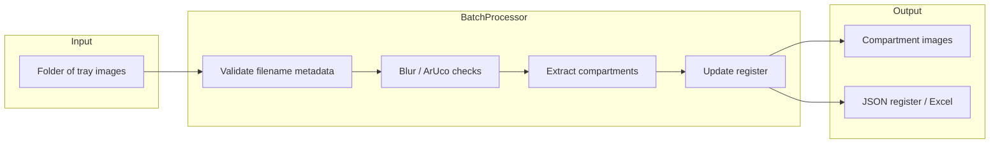
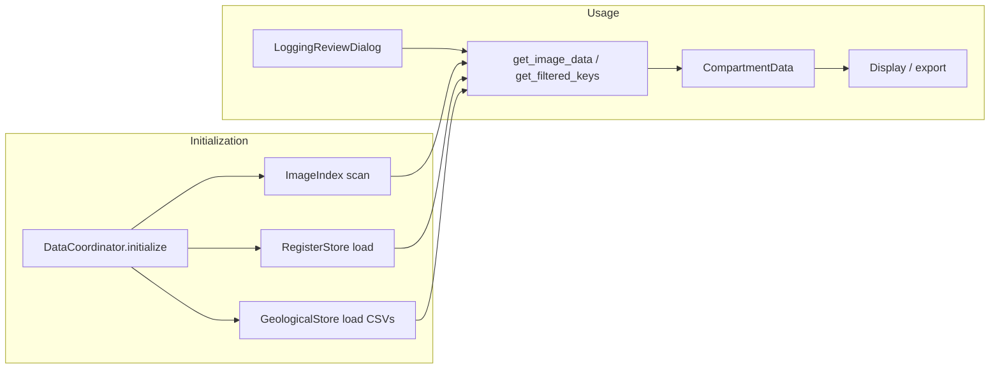
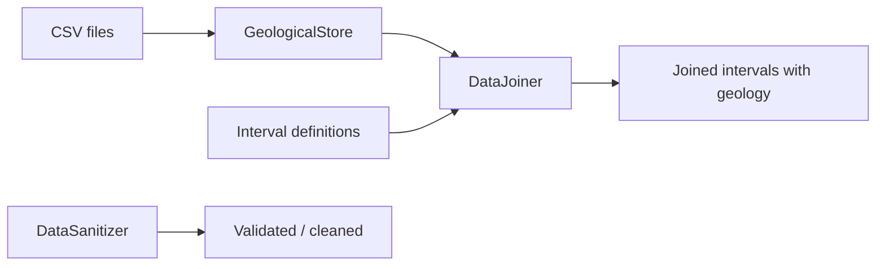

# GeoVue src Documentation Plan

## 1. Scope and audience

- **Scope:** Only `src` folder: `core`, `gui`, `processing`, `utils`, `resources`, `GeoVue_Capture`, and root `main.py` / `config.json`.
- **Audience:** Developers and maintainers; keep prose succinct and diagrams central.
- **Format:** Markdown docs plus Mermaid diagrams; one “master” doc with links to section files if the doc set grows.

---

## 2. Proposed documentation layout


| Doc                                          | Purpose                                                                           |
| -------------------------------------------- | --------------------------------------------------------------------------------- |
| **README (src)** or **docs/ARCHITECTURE.md** | One entry point: what GeoVue is, how to run, link to sub-docs.                    |
| **docs/ARCHITECTURE.md**                     | High-level architecture, folder map, layer diagram (Mermaid).                     |
| **docs/MODULES.md**                          | Key modules per package: responsibilities, main classes, and file roles.          |
| **docs/DATA.md**                             | Data handling: DataManager, DataCoordinator, stores, schema, key types.           |
| **docs/WORKFLOWS.md**                        | Main workflows with Mermaid diagrams (see below).                                 |
| **docs/TESTS.md**                            | Test layout, how to run, what each test dir/file covers.                          |
| **docs/FEATURES.md**                         | Products/features list, with short descriptions and where they live in `src`.     |
| **docs/OBSOLETE_AND_UNUSED.md**              | Audit of obsolete code, unused scripts, deprecated paths, and removal candidates. |


Keep each doc short (1–3 pages equivalent); use bullets and diagrams rather than long paragraphs.

---

## 3. Architecture summary (for ARCHITECTURE.md)

- **Entry:** [main.py](src/main.py) → first-run check → `MainGUI` (from [gui/main_gui.py](src/gui/main_gui.py)).
- **Layers:**
  - **Core:** config, paths, i18n, viz, repo updates ([core/](src/core/)).
  - **Processing:** batch pipeline, ArUco/blur, logging review, visualization, DataManager ([processing/](src/processing/)).
  - **GUI:** MainGUI, dialogs (logging review, QAQC, correlation, etc.), widgets ([gui/](src/gui/)).
  - **Utils:** register manager, sync, dedup, depth validation, pan/zoom ([utils/](src/utils/)).
  - **Resources:** assets, ArUco SVGs, color presets, translations ([resources/](src/resources/)).

Include a **Mermaid diagram**: `main → Core / Processing / GUI / Utils` and `GUI ↔ Processing ↔ DataManager`.

---

## 4. Key modules (for MODULES.md)

- **core:** `ConfigManager`, `FileManager`, `TranslationManager`, `VisualizationManager`, `RepoUpdater` — one short paragraph each and main file.
- **processing:** Top-level: `BatchProcessor`, `VisualizationDrawer`; subpackages: `ArucoMarkersAndBlurDetectionStep` (BlurDetector, ArucoManager), `LoggingReviewStep` (trace generator, color map, drillhole data/visualizer), `DataManager` (see Data section), and report/PDF/HTML generators.
- **gui:** `GUIManager`, `MainGUI`, `LoggingReviewDialog`, `QAQCManager`, `ProgressDialog`, `FirstRunDialog`, plus `ReviewDialog/`, `DrillholeCorrelation/`, `widgets/` — list main classes and one-line role.
- **utils:** `JSONRegisterManager`, `RegisterSynchronizer`, `UIDDeduplicationManager`, `DepthValidator`, `ImagePanZoomHandler`, and optional tools (`bulk_photo_renamer`, `find_missing_trays`, `cloud_sync_manager`).
- **GeoVue_Capture:** Standalone capture app and Raspberry Pi stepper script — one short subsection.

Use a simple table or bullet list: Module name | File(s) | Responsibility.

---

## 5. Data handling (for DATA.md)

- **DataCoordinator** ([processing/DataManager/data_coordinator.py](src/processing/DataManager/data_coordinator.py)): Single API for image + register + geological data; `initialize()`, `get_image_data()`, `get_filtered_keys()`, `CompartmentData`.
- **Stores:** `ImageIndex` (paths, scan), `RegisterStore` (JSON reviews/properties), `GeologicalStore` (CSV, MultiIndex), `ColorMapStore`, `RCMetricsStore` — one sentence each and key methods.
- **Schema & keys:** [schema.py](src/processing/DataManager/schema.py) (`DataSourceSchema`, `SchemaInferrer`, column types); [keys.py](src/processing/DataManager/keys.py) (`ImageKey`, `FilenameParser`).
- **Supporting:** `DataJoiner`, `IntervalMerger`, `DataSanitizer`, `ColumnResolver` ([column_aliases.py](src/processing/DataManager/column_aliases.py)), `survey_trace` (build_trace, xyz_at_depth).
- **Data flow diagram (Mermaid):** CSV/JSON + compartment folders → DataCoordinator.initialize → ImageIndex + RegisterStore + GeologicalStore; GUI/processing request → DataCoordinator → CompartmentData / filtered keys.

---

## 6. Main workflows — Mermaid diagrams (for WORKFLOWS.md)

**6.1 Application startup**




```

**6.2 Image processing pipeline (batch)**



**6.3 Logging review data flow**




**6.4 Data join / merge (geological + intervals)**




(Exact diagram syntax can be adjusted for your Mermaid version; the plan keeps node IDs safe per your mermaid rules.)

---

## 7. Tests (for TESTS.md)

- **Location:**
  - [src/tests/](src/tests/): e.g. `test_data_joining.py`
  - [src/processing/tests/](src/processing/tests/): e.g. `test_logging_review_report.py`
  - [src/processing/DataManager/tests/](src/processing/DataManager/tests/): geological_store, data_joiner, rc_metrics_store, survey_trace, survey_coordinator, settings_persistence, rc_metrics_accessibility
  - [src/gui/tests/](src/gui/tests/): dialog_helper, logging_review_report_dialog, themed_date_entry, viz_column_settings_dialog, qaqc_manager, register_updates
- **Running:** e.g. `pytest src/` or per-package; note Python version if relevant.
- **Table:** Test file | Module(s) under test | Brief purpose.

---

## 8. Features / products (for FEATURES.md)

Derived from [main.py](src/main.py) and exploration:

- **Chip tray processing:** ArUco-based compartment extraction, blur detection, optional OCR; batch or single-image.
- **QAQC:** Review extracted compartments, skip/process filters, visual debug.
- **Register & output:** Auto Excel register, JSON register, naming and organisation of outputs.
- **Logging review:** Drillhole data load, trace generation, visualization, filters, HTML/PDF reports.
- **Drillhole correlation:** Selection and correlation dialogs (DrillholeCorrelation).
- **Embedding training:** Dialog for ML step (MachineLearningStep).
- **Multi-language UI:** Translator in core.
- **Updates:** Repo updater check.
- **Utils:** Bulk photo renamer, find missing trays, cloud sync, deduplication, depth validation.
- **GeoVue Capture:** Separate capture app and Raspberry Pi hardware control.

Each feature: 1–2 sentences + primary `src` entry points (file or package).

---

## 9. Obsolete and unused code (for OBSOLETE_AND_UNUSED.md)

**Purpose:** One place to list obsolete/unused code and scripts so the codebase can be cleaned safely.

**How to identify:**

1. **Duplicate and backup files**
  - Explicit copies: e.g. `bulk_photo_renamer - Copy.py` in `src/utils/`.
  - Dated backups: e.g. `json_register_manager.py.backup_20260129` in `src/utils/`.
  - Document each with: path, reason (copy/backup), and recommendation (delete after confirming canonical file).
2. **Deprecated symbols and paths**
  - Grep for `deprecated`, `obsolete`, `TODO.*remove`, `backward compatibility` in `src`.
  - Known from scan:
    - **DrillholeDataManager:** Deprecated in favour of DataCoordinator; still referenced in `main.py`, `gui/logging_review_dialog.py`, `gui/widgets/advanced_filter_window.py`. Document as “deprecated – migrate to DataCoordinator; remove when all call sites updated.”
    - **Create New Register:** Replaced by “Data Settings” in `main_gui.py` (comment only; no dead UI if already removed).
  - List: symbol or UI element | location | replacement | action (remove when X).
3. **Standalone scripts vs app entry points**
  - **App entry point:** Only `src/main.py` is launched as the GeoVue app.
  - **Other `if __name__ == "__main__"` blocks:** Used for dev/test or standalone tools. List them and mark intent:
    - **Tools (keep):** `utils/bulk_photo_renamer.py`, `utils/find_missing_trays.py`, `GeoVue_Capture/geovue_capture_app.py`, `GeoVue_Capture/RaspberryPi/stepper_control_script.py`.
    - **Test/demo (document):** `test_png_uid.py`, `processing/DataManager/test_datamanager_gui.py`, `gui/DrillholeCorrelation/correlation_dialog.py`, `gui/DrillholeCorrelation/drillhole_selection_dialog.py`, `gui/column_settings_dialog.py`, `gui/color_map_editor_dialog.py`, `processing/DataManager/color_map_store.py`, `processing/DataManager/data_sanitizer.py` — clarify “run for testing/demo only, not part of main app.”
    - **Duplicate (obsolete):** `utils/bulk_photo_renamer - Copy.py` — document as removable duplicate of `bulk_photo_renamer.py`.
4. **Dead / unused fields and parameters**
  - In code comments: e.g. `json_register_manager.py` (“Cumulative_Offset_Y and Transform_Center removed (dead/unused fields)”); `core/file_manager.py` (depth_from/depth_to “unused but kept for signature compatibility”).
  - Record in OBSOLETE_AND_UNUSED.md: file | symbol/field | note (dead vs kept for API compatibility).
5. **Optional static checks (during doc phase or later)**
  - Unused imports: e.g. `pyflakes`, `ruff` on `src`.
  - Unreachable / unused code: e.g. `vulture` to list unused functions/classes.
  - Import graph: which modules are never imported from `main` or from any GUI/processing entry path (candidates for “unused” or “legacy”).

**Deliverable:** **docs/OBSOLETE_AND_UNUSED.md** with:

- Table 1: Duplicate/backup files (path, recommendation).
- Table 2: Deprecated symbols/paths (symbol, location, replacement, action).
- Table 3: Scripts with `__main__` (path, purpose: app / tool / test-demo / obsolete).
- Table 4: Dead/unused fields or parameters (file, symbol, note).
- Short “How this was identified” (grep patterns, tools, entry-point rules) so the audit can be re-run or updated.

**Process:** Run the identification steps above (grep, file list, optional static tools), then fill OBSOLETE_AND_UNUSED.md. Revisit after any refactor (e.g. removing DrillholeDataManager) to keep the doc accurate.

---

## 10. Documentation process

1. **Order:** ARCHITECTURE → MODULES → DATA → WORKFLOWS → TESTS → FEATURES → OBSOLETE_AND_UNUSED; README/entry point can be written first or last.
2. **Diagrams:** Add Mermaid to WORKFLOWS.md (and optionally one high-level in ARCHITECTURE.md); keep node IDs without spaces/special chars.
3. **Maintainability:** Single source of truth per topic; cross-link between docs; if something grows (e.g. DataManager), split DATA.md into DATA_OVERVIEW.md + DATA_DATAMANAGER.md.
4. **Review:** Quick pass for consistency of module names and file paths; verify all diagram references exist in `src`.

---

## 11. File and path conventions

- **Paths in docs:** Use forward slashes and relative from repo root, e.g. `src/processing/DataManager/data_coordinator.py`.
- **Code references:** Prefer “file + class/function name” over line numbers (line numbers change).
- **Diagrams:** Store in WORKFLOWS.md (or `docs/diagrams/` as separate `.mmd` files if you prefer).

This plan keeps the doc set small, scoped to `src`, and easy to read; Mermaid diagrams carry the main workflow story.